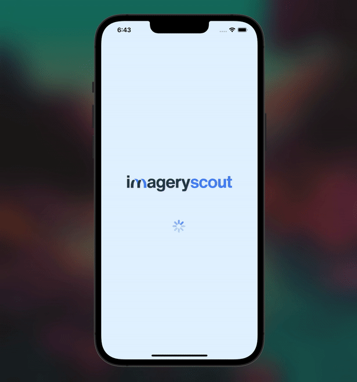

# 📸 Imagery Scout

Imagery Scout is an innovative React Native application that harnesses the power of dictionary-based searching, combined with the extensive Unsplash API, to deliver high-quality images based on user input.

# ✨ Features

Dictionary-Based Search:
Efficiently uses a dictionary categorized by word length for faster lookups.

Sanitize That Input:
Filters out those pesky special characters, ensuring only alphabets form the search term.

Smart Vowel Handling:
Cleverly replaces vowels with other alphabets for advanced search capabilities.

Precision Matching:
Searches the dictionary to find an exact match for the entered term.

Fuzzy Finding:
If an exact match isn't in the cards, don't worry! Imagery Scout will fetch the next best thing.

Time Complexity: O(n+K\*m)

# 🎥 [Demo](https://vimeo.com/872218235?share=copy)
  
  

# 🔧 Local Setup Guidelines

##### 1. Install Dependencies:

```bash
npm install
```

##### 2. Install PODS for IOS:

```bash
cd ios
```

```bash
pod install
```

##### 3. For iOS:

```bash
npx react-native run-ios
```

# 📘 API Documentation

For fetching stunning images, Imagery Scout taps into the vast reservoir of the Unsplash developers API. Dive into their official documentation for a deep understanding of the API's capabilities.
